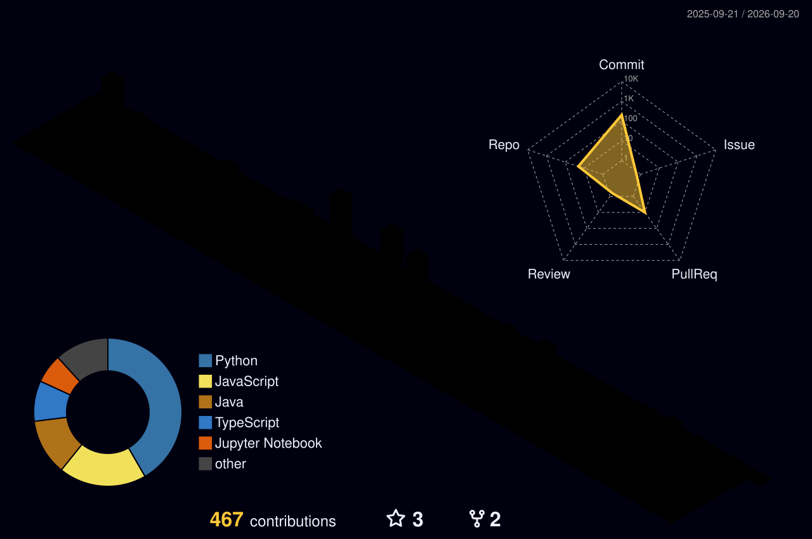

<h1>Hey, I'm Tejas </h1>

 

I build software that has to actually work once the demo's over — native Android apps, IoT systems that talk to real hardware, and backend services underneath them. I move between Kotlin, Python, and PHP depending on what the problem needs rather than sticking to one stack out of habit, and I'm just as comfortable debugging a dead touch sensor with a multimeter as I am shipping a UI.

Currently spending most of my time in mobile development and IoT integration, with backend and applied ML in the mix whenever a project calls for it.

 

  

## Contribution Graph

## 3D Contribution Calendar

## Trophies

## Stats

  
  

  

---

Reach out on [LinkedIn](https://www.linkedin.com/in/tejas-j-solanki2476/) or drop a line at **tejassolanki5881@gmail.com** — I reply.